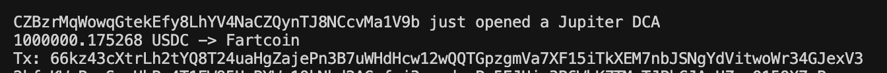
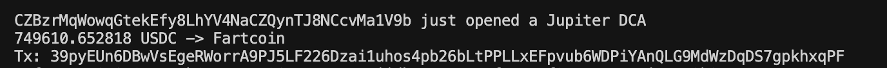

# USAGE
1. Clone the repo to use it locally with `git clone https://github.com/pbht/solana-dca-websocket-listener.git`
2. cd into the repo with `cd solana-dca-websocket-listener`
3. Create a .env file with environment variable `HELIUS_API_KEY=<YOUR-KEY>` and store in the project root
4. Build with `cargo build --release`
5. Run with `./target/release/solana-dca-websocket-listener` to run the script fully optimized

# CLI Args
The script defaults to flagging DCAs with SOL and USDC inputs above 5,000 USDC / 50 SOL in value. These parameters can be specified using the `--usdc` and `--sol` flags. For example, `./target/release/solana-dca-websocket-listener --usdc 10000` would flag all DCAs opened with input amounts of over 50 SOL (the default) or 10,000 USDC.

# INTERESTING OBSERVATIONS

This wallet opened ~$1.75M worth of DCAs to buy FARTCOIN

# TODO
- [x] Remove any hardcoded list indices (figure out how the lists are indexed)
- [x] Query tickers from Helius DAS
- [ ] Query $ value of input token (useful for non USDC / SOL inputs)
- [x] Filter orders above a $ value specified by CLI argument (have different thresholds for SOL and USDC inputs)
- [ ] Flag if a DCA was closed
- [ ] Add a --no-filter CLI flag to output every transaction despite input amount or input token
- [ ] Auto-reconnect when websocket connection is dropped

# Notes
This was one of my earlier Rust scripts. I intend to rewrite this more idiomatically and with better error handling. Working with the Jupiter DCA IDL has given me an idea to build a library (perhaps a macro will suffice?) that takes in an IDL as input and then is able to deserialize the transaction data such that the user can access the fields as they would expect to. I don't think this will be too hard to implement for Anchor programs and is a direction I would be interested in pursuing in the future.
